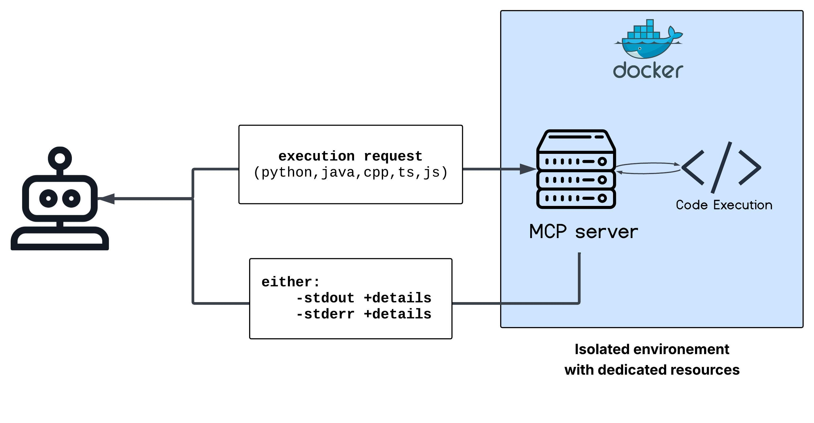

## MCP Code Executor Server

A robust **Model Context Protocol (MCP)** server that enables AI agents to execute code across multiple programming languages in a secure, isolated environment.

---

## 🚀 Overview

MCP Code Executor Server standardizes how AI models connect to various programming runtimes by exposing a unified MCP tool endpoint. It allows AI assistants to:

1. **Submit** code in a supported language.
2. **Execute** it in a controlled, sandboxed environment.
3. **Receive** output, including compilation or runtime errors.



---

## 🔑 Key Features

* **Multi-Language Support**: Java, Python, JavaScript, TypeScript, and C++.
* **Secure Execution**: Isolated containers with resource limits (CPU, memory, timeouts).
* **MCP Integration**: Conformant MCP server for seamless client discovery.
* **Automatic Compilation**: Handles compile-and-run for Java, C++, and TypeScript.
* **Detailed Error Feedback**: Returns both compile-time and runtime error messages.
* **Resource Cleanup**: Automatically deletes temporary files and enforces execution timeouts.

---

## 📐 Architecture

The MCP Code Executor Server follows a client-server model:

* **MCP Host**: AI application requesting code execution.
* **MCP Client**: Protocol client that connects to this server.
* **MCP Server**: This application, exposing code-execution tools.
* **Sandboxed Runtimes**: Containers or isolated processes per request.


---

## 🏁 Getting Started

### Prerequisites

* **Java 17+**
* **Python 3.8+**
* **Node.js & npm**
* **g++** or another C++ compiler

### Local Setup

1. **Clone the repository**:

   ```bash
   git clone https://github.com/yourusername/mcp-code-executor-server.git
   cd mcp-code-executor-server
   ```

2. **Build & Run**:

   ```bash
   # Build the project
   ./mvnw clean package

   # Start the server
   ./mvnw spring-boot:run
   ```

The server listens on port **8080** by default.

### Using Docker

For isolation, run in Docker:

```bash
# Build Docker image
docker build -t mcp-code-executor .

# Run container
docker run -p 8080:8080 mcp-code-executor
```

Or with Docker Compose:

```bash
docker-compose up -d
```

---

## 🛠️ Connecting MCP Clients

1. Start your MCP-compatible AI client.
2. Point it to `http://localhost:8080`.
3. Discover and invoke the `code-execution` tool.

Example MCP request:

```json
{
  "tool": "code-executor",
  "language": "python",
  "code": "print('Hello, world!')"
}
```

---

## 🔒 Security Considerations

* Implement stronger sandboxing (e.g., gVisor, Firecracker).
* Enforce strict CPU, memory, and I/O limits.
* Validate and sanitize input code.
* Add authentication/authorization for MCP connections.
* Restrict network access for executed code.

---

## 🤝 Contributing

Contributions are welcome! Please:

1. Fork the repo.
2. Create a feature branch (`git checkout -b feature/YourFeature`).
3. Commit your changes (`git commit -m 'Add feature'`).
4. Push to your branch (`git push origin feature/YourFeature`).
5. Open a Pull Request.

Please follow the existing code style and include tests for new functionality.

---

## 📄 License

Apache License 2.0. See the [LICENSE](LICENSE) file for details.
